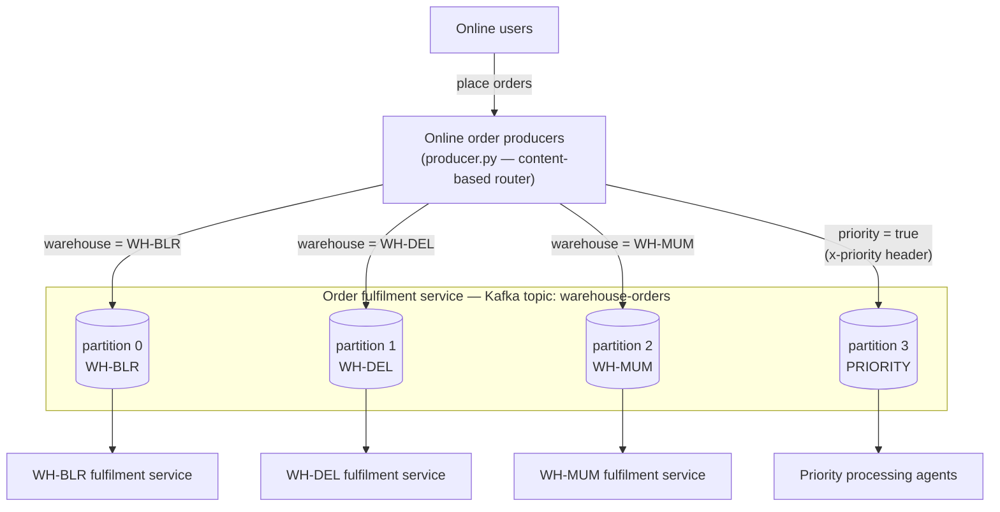
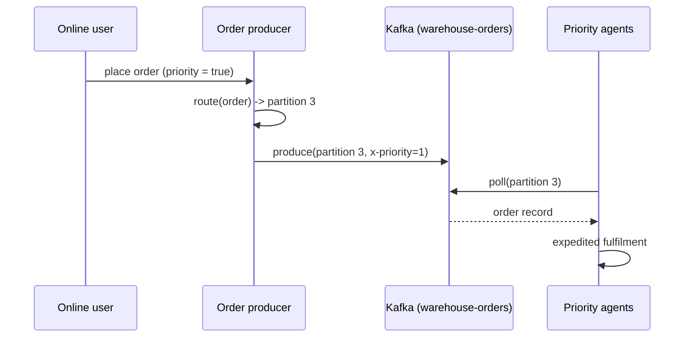

# Architecture — warehouse order fulfilment on Kafka

## Context and goals

An online storefront accepts orders from many concurrent users. Each order must be fulfilled by the warehouse it is destined for, and any order flagged as priority must be handled exclusively by a dedicated priority processing application — never by a regular warehouse service. Kafka acts as the order fulfilment service: a durable, ordered buffer that decouples the frontend (producers) from the fulfilment applications (consumers).

This simulation demonstrates that design with one producer process, three warehouse consumer processes, and one priority consumer process.

## Logical architecture



One topic, four partitions. The three left partitions are each owned by a warehouse; the fourth is reserved for priority traffic. Routing is decided entirely on the producer side from the order's content — Kafka brokers never inspect payloads.

## Components

| Component | Code | Role |
|---|---|---|
| Online order producers | `producer.py` | Frontend of the storefront. Generates orders on behalf of online users and routes each to a partition based on content: priority flag first, destination warehouse otherwise. Stamps every record with an `x-priority` header. |
| Order fulfilment service | Kafka topic `warehouse-orders` (`setup_topic.py`) | The stream. `len(WAREHOUSES) + 1` partitions: one per warehouse plus the priority partition. Created idempotently at startup; partition count is validated before any traffic flows. |
| Warehouse fulfilment services (×3) | `warehouse_consumer.py` + `consumer_base.py` | One process per warehouse (WH-BLR, WH-DEL, WH-MUM). Each pins itself to its own partition with `assign()` and processes normal orders, simulating fulfilment work. |
| Priority processing agents | `priority_consumer.py` + `consumer_base.py` | The only reader of the priority partition. Handles expedited orders for any warehouse, with a shorter simulated processing time. |
| Demo orchestrator | `run_demo.py` | Runs everything in one process (consumers as threads), then prints a summary and a routing check proving priority isolation. |
| Configuration | `config.py` | All tunables: broker address, topic, warehouses, routing table, order volume, priority ratio, timings. |

## Data flow

1. A user places an order; the frontend builds the order document.
2. `route(order)` picks the partition: `PRIORITY_PARTITION` if `priority` is true, else `WAREHOUSE_PARTITIONS[warehouse]`.
3. The record is produced with key = warehouse id, value = order JSON, header `x-priority` = `"1"`/`"0"`.
4. Each fulfilment application polls only its assigned partition and processes what arrives, committing offsets automatically.

Priority order sequence:



## Message contract

Value (JSON):

```json
{
  "order_id": "ORD-0004",
  "warehouse": "WH-DEL",
  "item": "laptop",
  "qty": 5,
  "priority": true,
  "created_at": "2026-08-20T10:15:04+00:00"
}
```

Key: warehouse id (string). Header: `x-priority` = `b"1"` or `b"0"`.

## Key decisions and trade-offs

**Producer-side, content-based routing.** Kafka has no broker-side routing, so the partition is chosen where the content is known — at the producer. The routing table lives in `config.py`, making it one obvious thing to change. Trade-off: every producer must carry the rule; at larger scale a stream processor (Kafka Streams / ksqlDB) would centralize it.

**A partition, not a separate topic, for priority.** Keeps the demo to one topic and shows partition-level routing. Trade-off: partition counts can only grow, and priority capacity is capped at one consumer. In production a separate `orders.priority` topic is the more common choice — the producer-side routing logic is identical.

**`assign()` instead of `subscribe()`.** With `subscribe()`, the group coordinator distributes partitions arbitrarily, so a warehouse consumer could be handed the priority partition after a rebalance. Manual assignment makes the priority guarantee structural rather than accidental. Trade-off: no automatic failover; a dead consumer's partition sits unread until the process restarts.

**Message stickiness.** All orders for one warehouse land on one partition (key = warehouse, fixed mapping), and a partition is a totally ordered log with a single reader — so per-warehouse ordering is preserved end to end.

**Isolation guarantee.** Priority orders can only reach the priority partition (producer rule) and the priority partition is only read by the priority application (manual assignment). `run_demo.py` asserts both properties after every run.

## Configuration reference (`config.py`)

| Parameter | Default | Meaning |
|---|---|---|
| `BOOTSTRAP_SERVERS` | `localhost:9092` | Kafka broker(s) |
| `TOPIC` | `warehouse-orders` | The order stream |
| `WAREHOUSES` | `WH-BLR, WH-DEL, WH-MUM` | Warehouse ids; partition map and count derive from this |
| `PRIORITY_RATIO` | `0.25` | Fraction of simulated orders flagged priority |
| `NUM_ORDERS` | `20` | Orders per producer run |
| `PRODUCE_DELAY_SEC` / `PROCESSING_TIME_SEC` / `PRIORITY_PROCESSING_TIME_SEC` | `0.2 / 0.2 / 0.05` | Simulated pacing |

Adding a warehouse = append to `WAREHOUSES` and recreate the topic (partition count must be ≥ warehouses + 1).

## Operational notes

Runs against any Kafka ≥ 2.x broker; a single-node KRaft compose file is provided (`docker-compose.yml`). Offsets are committed per consumer group (`fulfilment-<warehouse>`, `priority-fulfilment`), so restarts resume where they left off. See `README.md` for run instructions.
